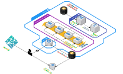

# Sakuten/infrastructure



## Deploy

```bash
cp <SOMEWHERE> dbgen/ids.json # Add ids.json

cp terraform.tfvars{.sample,}
vim terraform.tfvars # Set credentials

./scripts/deploy.sh
```

## Destroy

### Preserve Route53 Hosted Zone

```bash
./scripts/exclude-destroy.sh aws_route53_zone.sakuten
```

### Everything

```bash
terraform destroy
```
